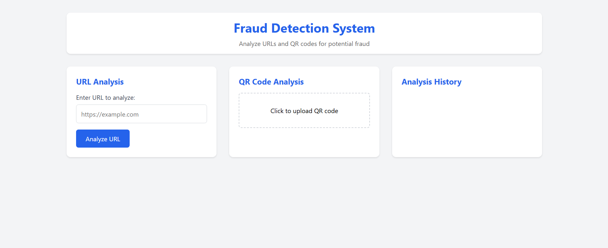

# 🚀 Fraud Detection System (URL & QR Code Analysis)

A hybrid fraud detection system that analyzes URLs and QR codes to identify potential phishing or fraudulent links. This project leverages machine learning and rule-based analysis to classify links as safe or fraudulent, providing a confidence score and risk level.

## 🔥 Features

-   ✅ **URL Analysis** - Detects malicious or suspicious URLs based on domain characteristics, patterns, and ML models.
-   ✅ **QR Code Analysis** - Extracts and scans URLs from QR codes for potential fraud.
-   ✅ **Risk Level & Confidence Score** - Displays fraud probability with a risk level (Low/Medium/High).
-   ✅ **History Tracking** - Saves previously analyzed URLs and QR codes for reference.
-   ✅ **Real-Time Detection** - Provides instant feedback on URLs & QR codes.
-   ✅ **Cross-Origin Support (CORS)** - Allows frontend (JavaScript) to communicate with backend (Flask).

## 🛠️ Tech Stack

-   **Frontend:** HTML, CSS, JavaScript
-   **Backend:** Python (Flask)
-   **Machine Learning:** Scikit-learn, Pandas, NumPy
-   **QR Code Processing:** OpenCV, pyzbar, Pillow
-   **CORS Handling:** Flask-CORS

## 🏗️ Project Setup

1.  **Clone the Repository**

    ```bash
    git clone [https://github.com/yourusername/fraud-detection.git](https://github.com/yourusername/fraud-detection.git)
    cd fraud-detection
    ```

2.  **Install Dependencies**

    ```bash
    pip install -r requirements.txt
    ```

3.  **Run the Flask Server**

    ```bash
    python app.py
    ```

    (Runs on `http://127.0.0.1:5000/` by default)

4.  **Start the Frontend**

    Open `index.html` in a browser or use Live Server (VS Code).

## 📌 API Endpoints

### 1️⃣ Analyze URL

-   **Endpoint:** `POST /analyze-url`

-   **Request:**

    ```json
    {
      "url": "[https://example.com](https://example.com)"
    }
    ```

-   **Response:**

    ```json
    {
      "is_fraud": true,
      "confidence": 85.6,
      "risk_level": "High",
      "risk_factors": ["Suspicious domain", "Contains unusual characters"]
    }
    ```

### 2️⃣ Analyze QR Code

-   **Endpoint:** `POST /analyze-qr`

-   **Request:**

    Upload an image containing a QR code

-   **Response:**

    ```json
    {
      "is_fraud": false,
      "confidence": 32.4,
      "risk_level": "Low"
    }
    ```

## 📸 Screenshots



## 👨‍💻 Contributors

Your Name - Ritesh Brahmachari
            Satyabrata Panigrahi
            Tanisha Dutta

## 📜 License

MIT License