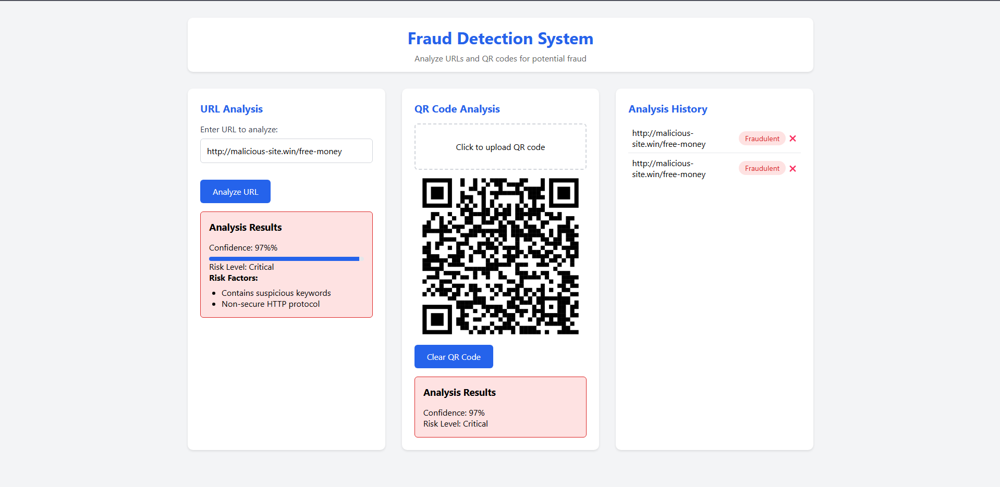

# 🚀 Fraud Detection System (URL & QR Code Analysis)

A hybrid fraud detection system that analyzes URLs and QR codes to identify potential phishing or fraudulent links. This project leverages machine learning and rule-based analysis to classify links as safe or fraudulent, providing a confidence score and risk level.

## 🔥 Features

✅ **URL Analysis** - Detects malicious or suspicious URLs based on domain characteristics, patterns, and ML models.

✅ **QR Code Analysis** - Extracts and scans URLs from QR codes for potential fraud.

✅ **Risk Level & Confidence Score** - Displays fraud probability with a risk level (Low/Medium/High).

✅ **History Tracking** - Saves previously analyzed URLs and QR codes for reference.

✅ **Real-Time Detection** - Provides instant feedback on URLs & QR codes.

✅ **Cross-Origin Support (CORS)** - Allows frontend (JavaScript) to communicate with backend (Flask).

## 🛠️ Tech Stack

- **Frontend**: HTML, CSS, JavaScript
- **Backend**: Python (Flask)
- **Machine Learning**: Scikit-learn, Pandas, NumPy
- **QR Code Processing**: OpenCV, pyzbar, Pillow
- **CORS Handling**: Flask-CORS

## 📊 Fraud Detection Metrics Comparison

### **Previous Metrics:**

```
              precision    recall  f1-score   support

           0       0.87      0.83      0.85       172
           1       0.79      0.84      0.81       128

    accuracy                           0.83       300
   macro avg       0.83      0.83      0.83       300
weighted avg       0.84      0.83      0.83       300
```

### **Updated Metrics:**

```
              precision    recall  f1-score   support

           0       0.85      0.90      0.88       162
           1       0.88      0.82      0.85       138

    accuracy                           0.86       300
   macro avg       0.86      0.86      0.86       300
weighted avg       0.86      0.86      0.86       300
```

## 🏗️ Project Setup

### Clone the Repository
```sh
git clone https://github.com/yourusername/fraud-detection.git
cd fraud-detection
```

### Install Dependencies
```sh
pip install -r requirements.txt
```

### ⚠️ **Important Prerequisite (for Windows Users)**

To avoid DLL-related errors (e.g., when using `pyzbar` or `OpenCV`), please install the Microsoft Visual C++ Redistributable packages from 2008 to 2015.

🔗 **Download Links:**

* **Visual C++ 2008 Redistributable (x64/x86):** [Download](https://www.microsoft.com/en-us/download/details.aspx?id=26368)

* **Visual C++ 2010 Redistributable (x64/x86):** [Download](https://www.microsoft.com/en-us/download/details.aspx?id=26999)

* **Visual C++ 2012 Redistributable (x64/x86):** [Download](https://www.microsoft.com/en-in/download/details.aspx?id=30679)

* **Visual C++ 2013 Redistributable (x64/x86):** [Download](https://www.microsoft.com/en-in/download/details.aspx?id=40784)

* **Visual C++ 2015-2022 Redistributable (x64):** [Download](https://aka.ms/vs/17/release/vc_redist.x64.exe)

* **Visual C++ 2015-2022 Redistributable (x86):** [Download](https://aka.ms/vs/17/release/vc_redist.x86.exe)


Make sure to install **both x86 and x64 versions** if you are running a 64-bit operating system.

### Run the Flask Server
```sh
python app.py
```
*(Runs on http://127.0.0.1:5000/ by default)*

### Start the Frontend
Open `index.html` in a browser or use Live Server (VS Code).

## 📌 API Endpoints

### 1️⃣ Analyze URL

**Endpoint:** `POST /analyze-url`

#### **Request:**
```json
{
  "url": "https://example.com"
}
```

#### **Response:**
```json
{
  "is_fraud": true,
  "confidence": 85.6,
  "risk_level": "High",
  "risk_factors": ["Suspicious domain", "Contains unusual characters"]
}
```

### 2️⃣ Analyze QR Code

**Endpoint:** `POST /analyze-qr`

#### **Request:**
Upload an image containing a QR code

#### **Response:**
```json
{
  "is_fraud": false,
  "confidence": 32.4,
  "risk_level": "Low"
}
```
## Screenshhot



## 👨‍💻 Contributors

- Ritesh Brahmachari  
- Satyabrata Panigrahi  
- Tanisha Dutta  

